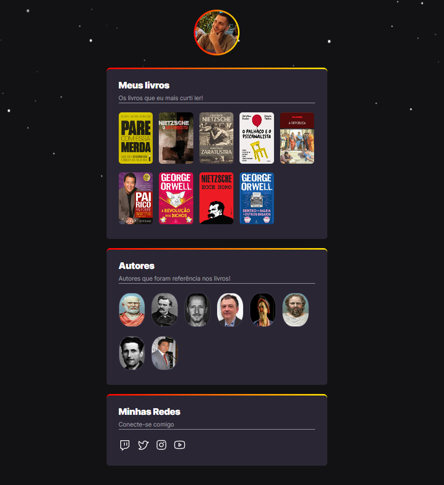

# NLW eSports

>Trilha Explorer

Projeto construído no evento Next Level Weel da Rocketseat.

>[Clique aqui para acessar o projeto](https://julielzissimo.github.io/NLW-eSports/)

## Tecnologias

- HTML
- CSS
- Git e Github

## O que aprendi
* Trabalhar com Git e Github
* Familiaridade com HTML e CSS
* Habilitar projetos para o público
* Soft skills que o desenvolvedor precisa ter
* Desenvolvimento de Networking

 ## Contato 

 juliel.mendonca@gmail.com